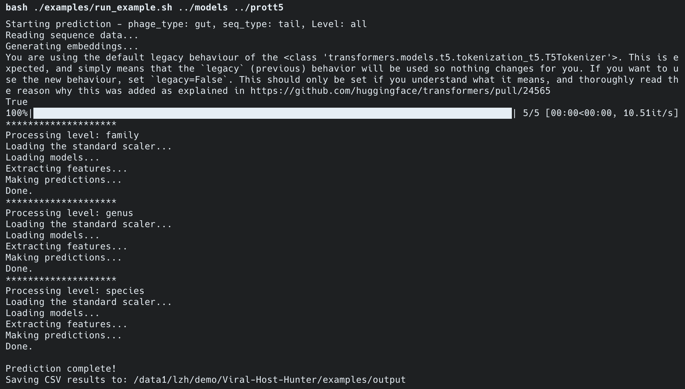

# VirHostHunter: Decrypting viral dark matter through key proteins using large language models

# Introduction

Understanding virus–host interactions is central to microbiome research, viral ecology, and phage therapy development. Yet, the majority of viral sequences in metagenomic datasets remain fragmental and host-unknown, collectively referred to as viral dark matter.

VirHostHunter (VHH) addresses this challenge through a protein-centered, alignment-free framework that predicts bacterial hosts of phages using key proteins such as tails and lysins, without requiring full genomes. By integrating Protein Language Models (PLMs) and Vision Transformers (ViTs), VHH captures functional homology beyond sequence similarity, enabling high-resolution and scalable host prediction.

This repository provides the datasets, model code, and usage accompanying the paper “Decrypting viral dark matter through key proteins using large language models”, supporting analyses and downstream applications in phage discovery and microbiome therapeutics.

## Contents

<!-- START doctoc generated TOC please keep comment here to allow auto update -->

<!---toc start-->

* [Introduction](#introduction)
* [1 Installation](#1-installation)
  * [1.1 Setup Environment](#11-setup-environment)
  * [1.3 Download Pretrained Models](#13-download-pretrained-models)
  * [1.4 Quick Test](#14-quick-test)
* [2 Usage](#2-usage)
  * [2.1 Parameters](#21-parameters)
  * [2.2 Output Description](#22-output-description)
* [3 Training (Optional)](#3-training-optional)
  * [3.1 Reproducing VirHostHunter Training](#31-reproducing-virhosthunter-training)
  * [3.2  Training with Custom Datasets](#32-training-with-custom-datasets)
* [4 Troubleshooting](#4-troubleshooting)
* [Contact Information](#contact-information)
* [License](#license)

<!---toc end-->

<!-- END doctoc generated TOC please keep comment here to allow auto update -->


# 1. Installation

> **⚠️ System Requirements**
> A GPU is **strongly recommended** for all steps (embedding, training, prediction). Running ProtT5 on a CPU is extremely slow and may lead to **numerical instability**.
> *Reference Hardware: NVIDIA RTX 3090 (24 GiB VRAM).*
>
> 🔗 **Support:** [Watch Video Guide](https://www.youtube.com/watch?v=qu0Hw80xRpY) • [Report Issue](https://github.com/YuehuaOu/Viral-Host-Hunter/issues) • [Email Us](#contact-information)

## 1.1 Setup Environment

VirHostHunter is built on Python 3.9, PyTorch 2.4.0, and CUDA 11.8. We recommend using a dedicated Conda environment to avoid conflicts.

First, create and activate the virtual environment:

```Bash
conda create -n VHH python=3.9
conda activate VHH
```

Then, choose one of the following methods to install VirHostHunter:

**Method 1: via Pip (Latest Development Version)**
```Bash

pip install git+https://github.com/YuehuaOu/Viral-Host-Hunter.git

```

**Method 2: via Conda**

```Bash
# Install PyTorch and CUDA dependencies
conda install pytorch==2.4.0 torchvision==0.19.0 torchaudio==2.4.0 pytorch-cuda=11.8 -c pytorch -c nvidia

# Install VirHostHunter v0.2.0 and additional dependencies
conda install -c conda-forge -c bioconda viral-host-hunter
```


> **💡 Installation Notes:**
> * **CUDA Compatibility:** If your CUDA version differs from 11.8, find the correct command at [PyTorch Previous Versions](https://pytorch.org/get-started/previous-versions/).
> * **Troubleshooting:** If you encounter `RuntimeError: CUDA error...` or other issues, please refer to [Section 4: Troubleshooting](#4-troubleshooting).

## 1.3 Download Pretrained Models

This tool requires two sets of model weights: the VirHostHunter trained models and the ProtT5 embedding model.

### A. VirHostHunter Models (Required)

Download and unzip the trained model weights from [Zenodo]((https://zenodo.org/records/17340381)):

```Bash
wget https://zenodo.org/records/17340381/files/models.zip
unzip models.zip
```

📝 **Usage Note:** Remember the path to the unzipped models directory. You will need to pass it to the --model_dir argument when running predictions later (e.g., `--model_dir /path/to/extracted/models`).

### B. ProtT5-XL-UniRef50 (For Offline Use Only)

VirHostHunter uses **ProtT5-XL-UniRef50** for protein embeddings. By default, the model is downloaded automatically if your machine has internet access.

**For Offline Use Only:** Manually download the files from Rostlab/prot_t5_xl_uniref50 to a local directory. Manually download the files manually from [Rostlab/prot_t5_xl_uniref50](https://huggingface.co/Rostlab/prot_t5_xl_uniref50/tree/main) and place them in a local directory.

⚠️ Important File Selection: You do NOT need to download all files. Please ensure your directory contains only the following:
- config.json
- pytorch_model.bin (The large 11GB file. No need to download other .bin or .safetensors files if present)
- special_tokens_map.json
- tokenizer_config.json
- spiece.model

📝 **Usage Note:** When running offline, pass your download path to the --prott5_dir argument (e.g., `--prott5_dir /path/to/local_prot_t5`).

## 1.4 Quick Test

We provide example data and scripts within the repository to help you verify a successful installation.

First, **clone the repository** to access the examples folder:

```Bash
git clone https://github.com/YuehuaOu/Viral-Host-Hunter.git
cd Viral-Host-Hunter
```

Then, run the provided shell script. Replace `/path/to/models_dir` with the directory where you unzipped the models in [Section 1.3](#13-download-pretrained-models).

```bash
# Syntax: bash ./examples/run_example.sh <model_dir> [prott5_dir]

bash ./examples/run_example.sh /path/to/models_dir               # online ProtT5
# or
bash ./examples/run_example.sh /path/to/models_dir /path/to/prott5_dir   # offline ProtT5
```

If the command runs successfully, you should see a result similar to the following:
<p align="center">
  
</p>

# 2 Usage

Use the `vhh-predict` command to perform viral host prediction with the pretrained model.

Example:

```bash
vhh-predict \
--protein /path/to/your/protein.fasta \
--dna /path/to/your/dna.fasta \
--seq_type tail \
--model_dir /path/to/models_dir
--phage_type gut
```

## 2.1 Parameters


| Category | Argument | Description | Default / Options |
| :--- | :--- | :--- | :--- |
| **Input** | `--protein` | **(Required)** Path to the protein FASTA file. | - |
| | `--dna` | **(Required)** Path to the corresponding DNA FASTA file. | - |
| | `--seq_type` | **(Required)** Protein type for prediction. | `tail`, `lysin` |
| **Model** | `--model_dir` | **(Required)** Directory containing trained models. | - |
| | `--phage_type` | Phage source environment (see details below). | `gut` (default), `environment` |
| | `--level` | Taxonomic prediction depth. | `all` (default), `family`, `genus`, `species` |
| Output | `--output_dir` | Directory to save prediction results. | `./output` |
| | `--output_format`| File format for results. | `csv` (default), `tsv`, `xlsx`, `both` (csv and xlsx) |
| | `--lineage` | Flag: Append full lineage columns to output. | *Disabled* |
| Other | `--embedding_dir` | Directory to save/load precomputed embeddings. | `./embeddings` |
| | `--prott5_dir` | Local ProtT5 path for **offline** mode. | - |

> **Note on `--phage_type`:**
> - `gut`: Uses the model trained on the **gut_prophages** dataset (disease-associated datasets in the paper).
> - `environment`: Uses the model trained on the **multi_taxonomic_levels** dataset (multi-taxonomic datasets in the paper).


## 2.2 Output Description

Prediction results land in $OUTPUT_DIR. All outputs share the same column layout:

- Columns 1–2: Input protein and DNA sequence ID
- Columns 4–7: Predicted hosts at different confidence thresholds (no threshold, 69%, 84%, 95%)

| Protein_Desc    | DNA_Desc    | No_Threshold     | Confidence_69%   | Confidence_84%   | Confidence_95%   |
| --------------- | ----------- | ---------------- | ---------------- | ---------------- | ---------------- |
| tail_1 #protein | tail_1 #dna | Eubacteriaceae   | Eubacteriaceae   | Unknown          | Unknown          |
| tail_2 #protein | tail_2 #dna | Eubacteriaceae   | Eubacteriaceae   | Eubacteriaceae   | Eubacteriaceae   |
| tail_3 #protein | tail_3 #dna | Xanthomonadaceae | Xanthomonadaceae | Xanthomonadaceae | Xanthomonadaceae |
| tail_4 #protein | tail_4 #dna | Xanthomonadaceae | Xanthomonadaceae | Xanthomonadaceae | Xanthomonadaceae |
| tail_5 #protein | tail_5 #dna | Bacteroidaceae   | Bacteroidaceae   | Unknown          | Unknown          |

If the `--lineage` option is applied, an additional set of columns containing the full host lineage will be included in the output.

# 3 Training (Optional)

## 3.1 Reproducing VirHostHunter Training

### 3.1.1 Data Preparation

To retrain VirHostHunter using the same datasets as in our paper, download and extract the training data using the following commands.
The datasets are pre-split into training, validation, and test sets according to the procedures described in the publication.

```bash
wget https://zenodo.org/records/17340915/files/data.zip
unzip data.zip
```

### 3.1.2 Model Training

Models can be trained for different datasets using the provided scripts:

- `vhh-train-gut`: training models on the gut prophage dataset
- `vhh-train-multi`: training models on the environmental phage dataset

*For more detailed parameter information, you can always run:*
```bash
vhh-train-gut -h
vhh-train-multi -h
```

Command Examples：

```bash
# Train models on the gut prophage dataset (lysin phage, species level)
vhh-train-gut \
--train_protein <path_to_data>/gut_prophages/lysin/species/train_protein.fasta \
--train_dna <path_to_data>/gut_prophages/lysin/species/train_dna.fasta \
--val_protein <path_to_data>/gut_prophages/lysin/species/val_protein.fasta \
--val_dna <path_to_data>/gut_prophages/lysin/species/val_dna.fasta \
--type lysin \
--level species

# Train models on the environmental phage dataset (tail phage, family level)
vhh-train-multi \
--train_protein <path_to_data>/multi_taxonomic_levels/tail/family/train_protein.fasta \
--train_dna <path_to_data>/multi_taxonomic_levels/tail/family/train_dna.fasta \
--val_protein <path_to_data>/multi_taxonomic_levels/tail/family/val_protein.fasta \
--val_dna <path_to_data>/multi_taxonomic_levels/tail/family/val_dna.fasta \
--type tail \
--level family
```
Tips:
- Use `--type` and `--level` to train models for different phage types and taxonomic levels. 


### 3.1.3 Prediction and Evaluation

After training, models are evaluated by using the test datasets to calculate the metrics:

- `vhh-predict-gut`: predicts and evaluates for the gut prophage dataset
- `vhh-predict-multi`: predicts and evaluates hosts for the environmental phage dataset

*For more detailed parameter information, you can always run:*
```bash
vhh-predict-gut -h
vhh-predict-multi -h
```

Command Examples：

```bash
# Predict and evaluate for the gut prophage dataset
vhh-predict-gut \
--protein_file <path_to_data>/gut_prophages/lysin/species/test_protein.fasta \
--dna_file <path_to_data>/gut_prophages/lysin/species/test_dna.fasta \
--type lysin \
--level species \
--precision -1 \
--result_dir /path/to/output_dir

# Predict and evaluate for the environmental phage dataset
vhh-predict-multi \
--protein_file <path_to_data>/multi_taxonomic_levels/tail/family/test_protein.fasta \
--dna_file <path_to_data>/multi_taxonomic_levels/tail/family/test_dna.fasta \
--type tail \
--level family \
--precision -1 \
--result_dir /path/to/output_dir
```

Tips:

- `--precision` sets the confidence threshold (95%, 84%, 69%, or -1 for no filtering).
- If a custom model path was specified during training, the same path should be provided with the `--model_dir` option during prediction.
- The directory for `--result_file` needs to be created in advance. We will fix this in the future to create it automatically.


## 3.2  Training with Custom Datasets

To retrain VirHostHunter using a custom dataset:

### 3.2.1 Prepare Custom Dataset

- Provide protein and DNA FASTA files.
- Add host labels in the format #`<host>` at the end of each FASTA header. For example:

```fasta
>GCF_944325205_gene_1582 #Desulfovibrionaceae
MADFDLAYAPVSKWEGGWTHDSGDKGGETFRGCARNFFPNEPIWPVIDREKSHPSYKQGK
AAFSAHLMGIPSLTGCVKGWYRKEWWDKLGLERFDQIVADELFEQAVNLGKAGMGRYLQR
LCNAFNWRKDGSADGARLFDDLQTDGVVGPKTLSALSIVLSRNDARRIVHLMNCMQGAHY
```

- Each protein sequence must has the corresponding DNA sequence, using the same sequence identifier and host tag. For example:

```
Protein FASTA file:
>GCF_944325205_gene_1582 #Desulfovibrionaceae
MADFDLAYAPVSKWEGGWTHDSGDKGGETFRGCARNFFPNEPIWPVIDREKSHPSYKQGK
AAFSAHLMGIPSLTGCVKGWYRKEWWDKLGLERFDQIVADELFEQAVNLGKAGMGRYLQR
LCNAFNWRKDGSADGARLFDDLQTDGVVGPKTLSALSIVLSRNDARRIVHLMNCMQGAHY
```

```
DNA FASTA file:
>GCF_944325205_gene_1582 #Desulfovibrionaceae
ATGGCTGATTTTGATCTGGCGTATGCTCCAGTTTCCAAGTGGGAAGGAGGATGGACCCAT
GATTCAGGCGATAAAGGCGGTGGCGAAGTTCCGCGGTGCGGCCCGGAATTTTTTCCGAAT
GAACCCATCTGGCCGGTCATTGACCGTGAAAAGAGCCACCCGTCATACAAACAGGGCAAG
```

### 3.2.2 Update Label Information

Define labels for the new dataset in a separate Python file (e.g., new_data_info.py) following the structure of `multi_taxonomic_levels_info.py` for providing labels corresponding to the customized dataset.

### 3.2.3 Modify Training Script

Adapt the training script for the new dataset, using `train_multi_taxonomic_levels.py` as a template. In particular, rReplace the label import statement with the new label file.

```
from .multi_taxonomic_levels_info import info
```

with:

```
from .new_data_info import info
```

### 3.2.4 Modify Predition Script

Apply analogous modifications to the prediction script as you did for training. Use `predict_multi_taxonomic_levels.py` as a reference, and replace the label import with the customized label file.

### 3.2.5 Model Training, Prediction and Evaluation

Follow the same procedures as described in Sections **3.1.2 Model Training** and **3.1.3 Prediction and Evaluation**.

# 4 Troubleshooting

This chapter summarizes common issues encountered by users, along with their causes and solutions.

## Could not solve for environment specs

**Error Message:**

```Plaintext
RuntimeError: CUDA error: no kernel image is available for execution on the device
```

**Cause:** This error indicates a mismatch between your installed PyTorch version and your system's CUDA version (or GPU driver capabilities). It often happens if you install the default PyTorch (which might be CPU-only or for a newer CUDA version) instead of the specific version required by your hardware.

**Solution:** Reinstall PyTorch with the appropriate CUDA toolkit version matching your GPU. You can find the correct installation commands at [PyTorch Previous Versions](https://pytorch.org/get-started/previous-versions/).

## CUDA & PyTorch Mismatch

**Error Message:**

```Plaintext
$ conda install -c conda-forge -c bioconda viral-host-hunter
......
Could not solve for environment specs 
The following package could not be installed
......
```

**Cause and Solution:** Channel priority or leftover index cache is pointing to an old version; clear the cache and try again.

```Bash
conda clean -i
conda install -c conda-forge -c bioconda viral-host-hunter
```

## torch.load Safety Check Error

**Error Message:**

```Plaintext
in check_torch_load_is_safe
raise ValueError(
ValueError: Due to a serious vulnerability issue in torch.load, even with weights_only=True, we now require users to upgrade torch to at least v2.6 in order to use the function...
See the vulnerability report here https://nvd.nist.gov/vuln/detail/CVE-2025-32434
```

**Cause:** This issue arises because `transformers >= 4.52` introduces a mandatory safety check for torch.load that requires `torch >= 2.6`. Since VirHostHunter is currently built on `torch == 2.4`, using a newer version of `transformers` will trigger this incompatibility.

**Note:** We have pinned `transformers<=4.51` in the latest configuration to prevent this, but you may encounter this if you manually upgrade dependencies.

**Solution:** Downgrade `transformers` to version `4.51` or lower:

```Bash
conda install -c conda-forge transformers=4.51
```
We are working on supporting torch==2.6 in the fulture release.


# Contact Information

1. Zihao Lin, 2410103047@mails.szu.edu.cn
2. Min Li, limin19@mails.ucas.edu.cn
3. Yuehua Ou, ouyuehua2022@email.szu.edu.cn
4. Bo Xing, xingbo@genomics.cn

# License

Viral-Host-Hunter is licensed under the **GPL-3.0** - see the LICENSE.txt file for full details.
